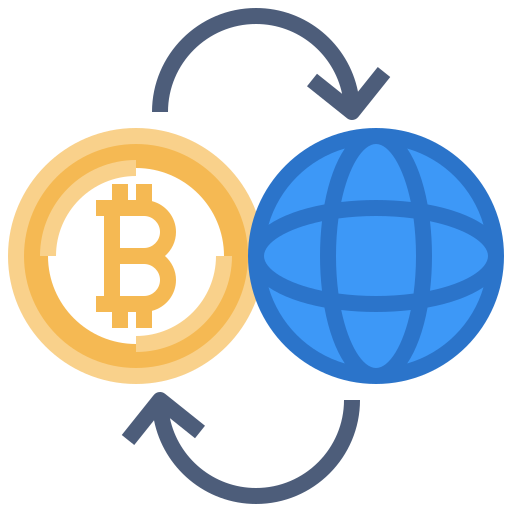

<!-- PROJECT LOGO -->
<br />
<p align="center">
<a href="https://github.com/EvaldasP/Crypto-API">
    
  </a>
  <h3 align="center">Crypto API</h3>

  <p align="center">
    <br />
    <a href="https://github.com/EvaldasP/Crypto-API"><strong>Explore the docs »</strong></a>
    <br />
    <br />
    ·
    <a href="https://github.com/EvaldasP/Crypto-API">Report Bug</a>
    ·
    <a href="https://github.com/EvaldasP/Crypto-API">Request Feature</a>
  </p>
</p>

<!-- ABOUT THE PROJECT -->

## About The Project

Fetching & Filtering Data from Api using JavaScript

### Built With

- [JavaScript](https://www.javascript.com/)

### Installation

1.  Clone the repo

    ```sh
      git clone https://github.com/evaldasp/Crypto-API.git
    ```

    <!-- USAGE EXAMPLES -->

<!-- CONTACT -->

## Contact

Evaldas Pocius - [@LinkedIn](https://www.linkedin.com/in/evaldaspocius/)

Project Link: [https://github.com/EvaldasP/Crypto-API](https://github.com/github_username/repo_name)
